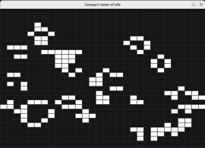

## Conway's Game of Life

This is a small implementation of [CGOL](https://en.wikipedia.org/wiki/Conway%27s_Game_of_Life) in C++.  
Rendering of the steps is done via [SDL2](https://www.libsdl.org/).  
Credit to [sdl-grid](https://github.com/catsocks/sdl-grid) for reference code of rendering a simple grid with SDL.

### Build Requirements  
* C++ compiler  
* CMake  
* libsdl
